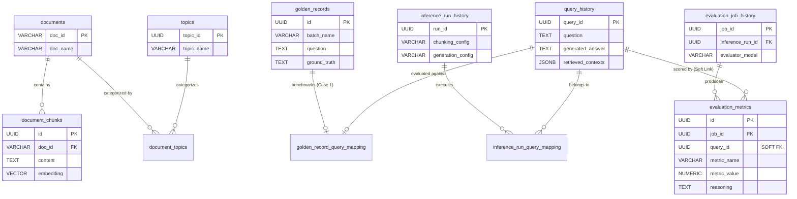

# Database Schema Design (Cloud SQL PostgreSQL + pgvector)

To support the Automated RAG Evaluator and Diagnoser, the database must store unstructured chunks, dense vector embeddings, and the structured evaluation metrics across various hyperparameter sweeps.

## Core Extension
Ensure the `vector` extension is enabled on the PostgreSQL instance:
```sql
CREATE EXTENSION IF NOT EXISTS vector;
```

---

## 🛡️ Enterprise Audit & Governance Standard (Bank-Grade Design)
Every table in this schema adheres to strict banking Data Governance and Auditing standards. Soft deletes (`is_deleted`) and full temporal/actor tracking (`created_at`, `created_by`, `updated_at`, `updated_by`) are strictly enforced across all entities.

---

## 🗺️ Entity-Relationship (ER) Diagram



---

## Table 1: `document_chunks`
Stores the parsed and chunked corpus (e.g., the HSBC Annual Report) alongside their vector embeddings. The table is designed to hold multiple chunking strategies simultaneously.

| Column Name    | Data Type | Description |
| :--- | :--- | :--- |
| `id`        | UUID (PK) | Unique identifier for the chunk. |
| `doc_id`      | VARCHAR  | Source document ID (e.g., 'HSBC_2025_Annual'). |
| `chunking_strategy`| VARCHAR  | The strategy used (e.g., 'fixed_256_overlap_32', 'semantic'). |
| `chunk_index`   | INT    | The sequential order of the chunk in the document. |
| `content`     | TEXT   | The actual extracted text payload. |
| `metadata`     | JSONB   | Additional context (e.g., page number, section header). |
| `embedding`    | VECTOR(768) | The dense vector embedding generated by Vertex AI/Gemini. |
| `created_by`    | VARCHAR  | Audit field: Actor who created the record. |
| `created_at`    | TIMESTAMP | Audit field: Record creation time. |
| `updated_by`    | VARCHAR  | Audit field: Actor who last modified the record. |
| `updated_at`    | TIMESTAMP | Audit field: Record last modification time. |
| `is_deleted`    | BOOLEAN  | Soft delete flag (default: FALSE). |

**Index Strategy:**
1. **ANN Vector Index:** To support efficient dense retrieval, an HNSW or IVFFlat index is applied to the `embedding` column.
2. **Composite Filtering Index:** A B-tree index on `(doc_id, chunking_strategy)` to support lightning-fast metadata pre-filtering during the `optimizer_config` sweep, ensuring the vector search only runs on the relevant chunking configuration.
```sql
CREATE INDEX idx_doc_chunks_embedding ON document_chunks USING hnsw (embedding vector_cosine_ops);
CREATE INDEX idx_doc_chunks_filter ON document_chunks (doc_id, chunking_strategy) WHERE is_deleted = FALSE;
```

---

## Table 2: `inference_run_history`
Stores the metadata for each distinct generation sweep (a unique combination of RAG configurations).

| Column Name     | Data Type | Description |
| :--- | :--- | :--- |
| `run_id`      | UUID (PK) | Unique identifier for the specific experiment run. |
| `start_time`    | TIMESTAMP | The exact timestamp when the batch inference run initiated. |
| `end_time`     | TIMESTAMP | The exact timestamp when the batch inference run completed all queries. |
| `chunking_config`  | VARCHAR  | e.g., 'fixed_512_overlap_64'. |
| `indexing_config`  | VARCHAR  | e.g., 'hybrid_bm25_dense'. |
| `reranking_config` | VARCHAR  | e.g., 'cross_encoder_miniLM'. |
| `prompting_config` | VARCHAR  | e.g., 'step_back'. |
| `generation_config` | VARCHAR  | e.g., 'strict_citation_low_temp'. |

| `cost_estimate`   | FLOAT   | Estimated API cost (token usage) for this run. |
| `created_by`    | VARCHAR  | Audit field: Actor who created the record. |
| `created_at`    | TIMESTAMP | Audit field: Record creation time. |
| `updated_by`    | VARCHAR  | Audit field: Actor who last modified the record. |
| `updated_at`    | TIMESTAMP | Audit field: Record last modification time. |
| `is_deleted`    | BOOLEAN  | Soft delete flag (default: FALSE). |

**Index Strategy:**
**Time-Series Lookup Index:** A descending B-tree index on the `timestamp` column to quickly retrieve the latest runs.
```sql
CREATE INDEX idx_inf_runs_timestamp ON inference_run_history (start_time DESC) WHERE is_deleted = FALSE;
```

---

## Table 2.5: `evaluation_job_history`
Stores the metadata for the evaluation runs. This completely decouples the evaluation logic (using an LLM as a judge) from the initial RAG generation. One `inference_run` can be evaluated multiple times by different `evaluation_job_history` (e.g., using different evaluator models).

| Column Name     | Data Type | Description |
| :--- | :--- | :--- |
| `job_id`      | UUID (PK) | Unique identifier for the evaluation job. |
| `inference_run_id` | UUID   | Links back to the `inference_run_history.run_id`. |
| `start_time`    | TIMESTAMP | The exact timestamp when the evaluation job initiated. |
| `end_time`     | TIMESTAMP | The exact timestamp when the evaluation job completed. |
| `evaluator_model`  | VARCHAR  | e.g., 'gemini-2.5-pro', 'gpt-4o'. |
| `evaluator_prompt_version` | VARCHAR | Tracks the specific system prompt used by the judge. |
| `cost_estimate`   | FLOAT   | Estimated API cost for the evaluation job. |
| `created_by`    | VARCHAR  | Audit field: Actor who created the record. |
| `created_at`    | TIMESTAMP | Audit field: Record creation time. |
| `updated_by`    | VARCHAR  | Audit field: Actor who last modified the record. |
| `updated_at`    | TIMESTAMP | Audit field: Record last modification time. |
| `is_deleted`    | BOOLEAN  | Soft delete flag (default: FALSE). |

**Index Strategy:**
**Time-Series Lookup Index:** A descending B-tree index.
```sql
CREATE INDEX idx_eval_jobs_timestamp ON evaluation_job_history (start_time DESC) WHERE is_deleted = FALSE;
```

---

## Table 3: `evaluation_metrics` (Upgraded EAV Model)
Stores the very granular, per-query, per-metric evaluation results generated by the `RAGEvaluator`. This table employs an Entity-Attribute-Value (EAV) design pattern, maximizing extensibility without requiring schema modifications when new evaluation metrics are introduced. Crucially, it includes per-metric reasoning to provide precise explainability for every score awarded by the LLM Judge.

| Column Name       | Data Type  | Description |
| :---          | :---     | :---    |
| `id`          | UUID (PK)  | Unique row identifier. |
| `job_id`        | UUID     | Links back to `evaluation_job_history.job_id`. |
| `query_id`       | UUID     | SOFT LINK to `query_history.query_id`. Identifies the exact RAG generation attempt evaluated. |
| `evaluation_strategy`  | VARCHAR(50) | The evaluation framework used (e.g., 'CASE1_GROUND_TRUTH', 'CASE2_RAG_TRIAD'). |
| `metric_category`    | VARCHAR(50) | Categorization of the metric (e.g., 'generation', 'retrieval', 'end_to_end'). |
| `metric_name`      | VARCHAR(50) | Specific metric tracked (e.g., 'Faithfulness', 'Answer_Relevance', 'Context_Relevance', 'Correctness'). |
| `metric_value`     | NUMERIC(5,4) | The calculated or judged score (e.g., 4.5000, 1.0000). |
| `reasoning`       | TEXT     | The explicit justification/commentary provided by the LLM Judge *specifically* for this metric. |
| `created_by`      | VARCHAR(50) | Audit field: Actor who created the record. |
| `created_at`      | TIMESTAMP  | Audit field: Record creation time. |
| `updated_by`      | VARCHAR(50) | Audit field: Actor who last modified the record. |
| `updated_at`      | TIMESTAMP  | Audit field: Record last modification time. |
| `is_deleted`      | BOOLEAN   | Soft delete flag (default: FALSE). |

**Index Strategy:**
1. **Logical Unique Constraint:** `UNIQUE (query_id, evaluation_strategy, metric_name, job_id)` prevents the same evaluator run from scoring the exact same metric twice for a single query.
2. **Diagnoser Aggregation Index:** A composite B-tree index heavily optimizes the `GROUP BY` and `AVG()` queries executed by the `RAGDiagnoser`.
```sql
CREATE INDEX idx_eval_metrics_diagnoser ON evaluation_metrics (job_id, evaluation_strategy, metric_name) WHERE is_deleted = FALSE;
```

---

## Table 4: `documents` (Corpus Metadata)
Stores high-level metadata for the source documents. This separates document-level properties from the granular chunk data, ensuring a normalized and scalable architecture.

| Column Name   | Data Type | Description |
| :--- | :--- | :--- |
| `doc_id`    | VARCHAR (PK) | Unique document identifier (e.g., 'DOC001', 'HSBC_2025_Annual'). |
| `doc_name`   | VARCHAR  | Human-readable document name (e.g., 'HSBC Annual Report 2025'). |
| `description`  | TEXT   | A brief summary of the document's contents. |
| `metadata`   | JSONB   | Extensible document-level metadata (e.g., author, source_url). |
| `created_by`    | VARCHAR  | Audit field: Actor who created the record. |
| `created_at`    | TIMESTAMP | Audit field: Record creation time. |
| `updated_by`    | VARCHAR  | Audit field: Actor who last modified the record. |
| `updated_at`    | TIMESTAMP | Audit field: Record last modification time. |
| `is_deleted`    | BOOLEAN  | Soft delete flag (default: FALSE). |

**Index Strategy:**
**Partial Active Lookup Index:** A B-tree index filtering out soft-deleted records to speed up active document retrieval and pagination.
```sql
CREATE INDEX idx_documents_active ON documents (doc_id) WHERE is_deleted = FALSE;
```

---

## Table 5: `topics`
Stores the distinct topics or domains that documents can be categorized under.

| Column Name  | Data Type | Description |
| :--- | :--- | :--- |
| `topic_id`  | UUID (PK) | Unique identifier for the topic. |
| `topic_name` | VARCHAR  | The name of the topic (e.g., 'credit_risk', 'banking_regulation'). |
| `created_by`    | VARCHAR  | Audit field: Actor who created the record. |
| `created_at`    | TIMESTAMP | Audit field: Record creation time. |
| `updated_by`    | VARCHAR  | Audit field: Actor who last modified the record. |
| `updated_at`    | TIMESTAMP | Audit field: Record last modification time. |
| `is_deleted`    | BOOLEAN  | Soft delete flag (default: FALSE). |

**Index Strategy:**
**Unique Semantic Index:** A unique B-tree index on `topic_name` to prevent duplicate insertions of topics and allow O(1) lookups during the topic-to-document resolution phase.
```sql
CREATE UNIQUE INDEX udx_topics_name ON topics (topic_name) WHERE is_deleted = FALSE;
```

---

## Table 6: `document_topics` (Many-to-Many Mapping)
Resolves the many-to-many relationship between `documents` and `topics`. A single annual report might cover 'credit_risk', 'wealth', and 'retail_banking'.

| Column Name | Data Type | Description |
| :--- | :--- | :--- |
| `doc_id`  | VARCHAR| Links back to `documents.doc_id`. |
| `topic_id` | UUID  | Links back to `topics.topic_id`. |
| `created_by`    | VARCHAR  | Audit field: Actor who created the record. |
| `created_at`    | TIMESTAMP | Audit field: Record creation time. |
| `updated_by`    | VARCHAR  | Audit field: Actor who last modified the record. |
| `updated_at`    | TIMESTAMP | Audit field: Record last modification time. |
| `is_deleted`    | BOOLEAN  | Soft delete flag (default: FALSE). |

**Index Strategy:**
**Reverse Lookup Index:** While `(doc_id, topic_id)` acts as the composite Primary Key (which implies an index), an explicit reverse B-tree index on `(topic_id, doc_id)` is required to rapidly find all documents associated with a specific topic without triggering a full table scan.
```sql
CREATE INDEX idx_doc_topics_reverse ON document_topics (topic_id, doc_id) WHERE is_deleted = FALSE;
```


---

## Table 7: `query_history` (RAG Interaction Logs)
Stores the actual user questions, the retrieved context chunks, and the final generated answers for every RAG interaction. This serves as the system's operational log for both regular users and automated evaluations.

| Column Name     | Data Type | Description |
| :---         | :---   | :---    |
| `query_id`      | UUID (PK) | Unique identifier for this specific Q&A interaction. |
| `queried_by`     | VARCHAR  | The identity of the requester (e.g., 'user:jason.pan', 'system:eval_runner', 'api_key:xxx'). |
| `question`      | TEXT   | The raw query asked by the user (or the evaluation dataset). |
| `retrieved_contexts` | JSONB   | An array of objects containing the retrieved `chunk_id`, raw `text`, and `similarity_score`. |
| `generated_answer`  | TEXT   | The final synthesized answer produced by the LLM (Generator). |
| `query_time`     | TIMESTAMP | The exact timestamp when the user or evaluation script dispatched the query. |
| `retrieval_time`   | TIMESTAMP | The exact timestamp when the vector database returned the retrieved context chunks. |
| `response_time`   | TIMESTAMP | The exact timestamp when the RAG Agent successfully returned the synthesized answer. |
| `ground_truth`    | TEXT   | (Optional) The expected standard answer, used for direct metrics like Recall. |
| `created_by`     | VARCHAR  | Audit field: Actor who created the record (e.g., 'user_123' or 'eval_runner'). |
| `created_at`     | TIMESTAMP | Audit field: Record creation time. |
| `updated_by`     | VARCHAR  | Audit field: Actor who last modified the record. |
| `updated_at`     | TIMESTAMP | Audit field: Record last modification time. |
| `is_deleted`     | BOOLEAN  | Soft delete flag (default: FALSE). |

**Index Strategy:**
**Requester Audit Index:** A B-tree index on `queried_by` to quickly retrieve all queries issued by a specific user, system service, or evaluation runner script for auditing and usage analytics.
```sql
CREATE INDEX idx_query_hist_requester ON query_history (queried_by) WHERE is_deleted = FALSE;
```


---

## Table 8: `inference_run_query_mapping` (Inference Run to Query Mapping)
Resolves the many-to-many relationship between `inference_run_history` and `query_history`.
In an enterprise RAG system, `query_history` logs all traffic (real users + automated tests). This table isolates specific subsets of queries that belong to a managed hyperparameter sweep (a "Run").

| Column Name | Data Type | Description |
| :--- | :--- | :--- |
| `run_id`  | UUID | Links back to `inference_run_history.run_id`. |
| `query_id` | UUID | Links back to `query_history.query_id`. |
| `created_by`    | VARCHAR  | Audit field: Actor who created the record. |
| `created_at`    | TIMESTAMP | Audit field: Record creation time. |
| `updated_by`    | VARCHAR  | Audit field: Actor who last modified the record. |
| `updated_at`    | TIMESTAMP | Audit field: Record last modification time. |
| `is_deleted`    | BOOLEAN  | Soft delete flag (default: FALSE). |

**Index Strategy:**
**Reverse Lookup Index:** An explicit reverse B-tree index on `(query_id, run_id)` to rapidly find which inference runs a specific query was included in, supporting cross-run diagnostics.
```sql
CREATE INDEX idx_inference_run_query_mapping_reverse ON inference_run_query_mapping (query_id, run_id) WHERE is_deleted = FALSE;
```


---

## Table 9: `golden_records` (Evaluation Benchmark Dataset)
The "North Star" asset for RAG evaluation. Authored by human domain experts (SMEs), these static records contain the exact baseline answers required for Case 1 (Direct Evaluation).

| Column Name    | Data Type | Description |
| :---       | :---   | :---    |
| `id`       | UUID (PK) | Unique identifier for this specific golden test case. |
| `batch_name`  | VARCHAR  | Logical grouping of the test cases (e.g., 'v1_hsbc_2025_annual_report_q1'). |
| `question`    | TEXT   | The exact, canonical query string to be fed into the RAG pipeline. |
| `ground_truth`  | TEXT   | The human-expert verified "exact answer" to serve as the benchmark baseline. |
| `expected_topics` | JSONB   | (Optional) Array of `topic_name` strings the retrieval *should* theoretically hit. |
| `complexity`   | VARCHAR  | (Optional) Categorization (e.g., 'Factoid', 'Multi-hop', 'Reasoning') for granular metric analysis. |
| `created_by`   | VARCHAR  | Audit field: Actor who created the record. |
| `created_at`   | TIMESTAMP | Audit field: Record creation time. |
| `updated_by`   | VARCHAR  | Audit field: Actor who last modified the record. |
| `updated_at`   | TIMESTAMP | Audit field: Record last modification time. |
| `is_deleted`   | BOOLEAN  | Soft delete flag (default: FALSE). |

**Index Strategy:**
**Dataset Lookup Index:** A B-tree index on `batch_name` to allow the automated evaluation runner to swiftly load hundreds of golden questions for a batch parameter sweep.
```sql
CREATE INDEX idx_golden_records_dataset ON golden_records (batch_name) WHERE is_deleted = FALSE;
```

---

## Table 10: `golden_record_query_mapping` (Ground Truth to Query Resolution)
Enforces **strict separation of concerns** between dynamic operational logs (`query_history`) and static evaluation benchmarks (`golden_records`). By extracting this 1:1 relationship into a dedicated mapping table, we prevent the core `query_history` table from being polluted by nullable, evaluation-specific foreign keys (`golden_record_id`).

| Column Name     | Data Type | Description |
| :---        | :---   | :---    |
| `query_id`     | UUID | Links back to `query_history.query_id`. The specific generation attempt. |
| `golden_record_id` | UUID | Links back to `golden_records.id`. The human-verified baseline. |
| `created_by`    | VARCHAR  | Audit field: Actor who created the record. |
| `created_at`    | TIMESTAMP | Audit field: Record creation time. |
| `updated_by`    | VARCHAR  | Audit field: Actor who last modified the record. |
| `updated_at`    | TIMESTAMP | Audit field: Record last modification time. |
| `is_deleted`    | BOOLEAN  | Soft delete flag (default: FALSE). |

**Index Strategy:**
**Evaluation Join Index:** An explicit reverse B-tree index on `(golden_record_id, query_id)` to rapidly join generated answers with their corresponding ground truth baselines during the automated grading phase without performing full table scans.
```sql
CREATE INDEX idx_eval_query_mappings ON golden_record_query_mapping (golden_record_id, query_id) WHERE is_deleted = FALSE;
```


---

## 📊 View 1: `v_evaluation_metrics_pivot` (RAG Triad Analysis View)
While the underlying `evaluation_metrics` uses a flexible EAV (Entity-Attribute-Value) "long table" design to support infinite new metrics without schema changes, analysts and BI dashboards often require a "wide table" format. 

This PostgreSQL view joins with `query_history` and pivots the core metrics (Correctness, Context Relevance, Faithfulness, Answer Relevance) into columns. This provides a human-readable, flattened dataset complete with the original query and answer text, making it exact for immediate diagnosis and exporting to CSVs or Pandas DataFrames.

```sql
CREATE OR REPLACE VIEW v_evaluation_metrics_pivot AS
SELECT 
    e.job_id,
    e.query_id,
    qh.question,
    qh.generated_answer,
    qh.retrieved_contexts,
    gr.ground_truth,
    MAX(CASE WHEN e.metric_name = 'context_relevance' THEN e.metric_value END) AS context_relevance_score,
    MAX(CASE WHEN e.metric_name = 'context_relevance' THEN e.reasoning END) AS context_relevance_reasoning,
    MAX(CASE WHEN e.metric_name = 'faithfulness' THEN e.metric_value END) AS faithfulness_score,
    MAX(CASE WHEN e.metric_name = 'faithfulness' THEN e.reasoning END) AS faithfulness_reasoning,
    MAX(CASE WHEN e.metric_name = 'answer_relevance' THEN e.metric_value END) AS answer_relevance_score,
    MAX(CASE WHEN e.metric_name = 'answer_relevance' THEN e.reasoning END) AS answer_relevance_reasoning,
    MAX(CASE WHEN e.metric_name = 'correctness' THEN e.metric_value END) AS correctness_score,
    MAX(CASE WHEN e.metric_name = 'correctness' THEN e.reasoning END) AS correctness_reasoning,
    MAX(CASE WHEN e.metric_name = 'semantic_similarity' THEN e.metric_value END) AS semantic_similarity_score,
    MAX(CASE WHEN e.metric_name = 'semantic_similarity' THEN e.reasoning END) AS semantic_similarity_reasoning
FROM evaluation_metrics e
JOIN query_history qh ON e.query_id = qh.query_id
LEFT JOIN golden_record_query_mapping grm ON qh.query_id = grm.query_id
LEFT JOIN golden_records gr ON grm.golden_record_id = gr.id AND gr.is_deleted = FALSE
WHERE e.is_deleted = FALSE AND qh.is_deleted = FALSE
GROUP BY e.job_id, e.query_id, qh.question, qh.generated_answer, qh.retrieved_contexts, gr.ground_truth;
```

## 💡 Architecture Note: Metadata Pre-filtering (Hybrid Search) & Auditability
By introducing the `documents` and `document_topics` tables, this architecture natively supports **Metadata Pre-filtering (or Hybrid Vector Search)**. 
When the RAG Agent processes a user query that implies a specific domain (e.g., *"What are the credit risks..."*), the system can first execute a standard SQL `JOIN` on `document_topics` to isolate the relevant `doc_id`s for 'credit_risk'. The dense vector search (ANN / k-NN) is then executed **strictly within this filtered subset of `document_chunks`** (optimized via `idx_doc_chunks_filter`). 
This guarantees that the LLM will not hallucinate answers from irrelevant domains and significantly accelerates the vector search latency over a massive corpus.

Additionally, this schema enforces **standard Auditability**. The inclusion of `created_by`, `created_at`, `updated_by`, `updated_at`, and `is_deleted` (Soft Delete) across *every single table* reflects the rigorous data governance and lineage tracking required by Tier-1 banking environments. No record is ever truly lost, guaranteeing full compliance and reproducibility of the RAG evaluation history.
