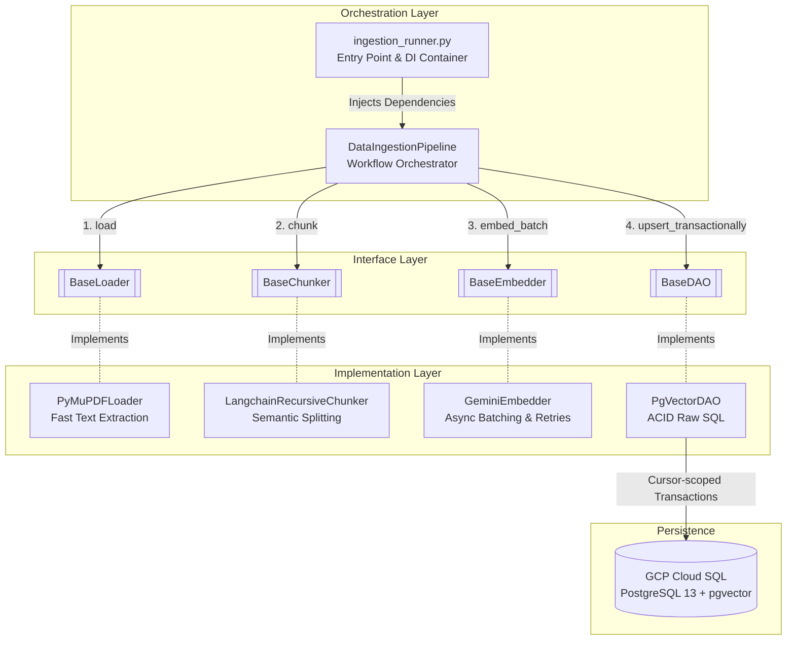
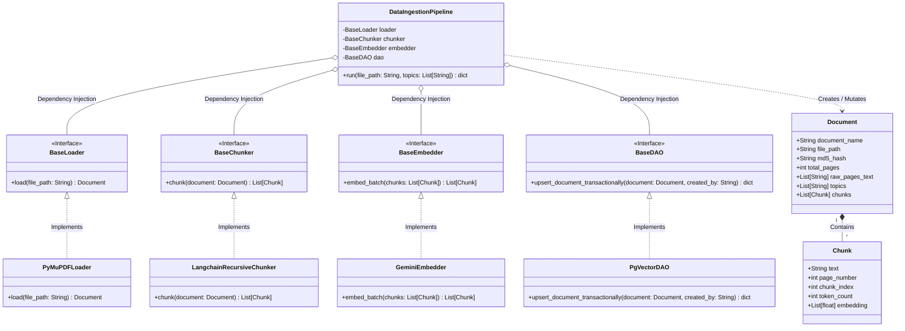

# Phase 1: Data Ingestion Architecture & Logic

## 1. Overview
The Data Ingestion phase is responsible for transforming raw, unstructured PDF documents (e.g., HSBC Annual Reports) into structured, vectorized semantic chunks persisted in a PostgreSQL (`pgvector`) database. 

The architecture strictly adheres to **SOLID principles** and **Clean Architecture**. It utilizes **Dependency Injection (DI)** to decouple the orchestrator from specific implementations, allowing components to be easily mocked for testing or swapped out (e.g., changing Gemini to OpenAI) without touching the core business logic.

---

## 2. Architecture Diagram (Mermaid)

---

## 3. Class Diagram (UML)

---

## 4. Core Modules & Classes Deep Dive

### 3.1 Domain Layer (`src/domain/models.py`)
Data Transfer Objects (DTOs) powered by Pydantic for strict type validation.
* **`Document`**: Represents the parsed file, holding metadata (MD5 hash for idempotency, total pages, file path) and a list of its chunks.
* **`Chunk`**: Represents a specific text block. Contains the raw text, page number, sequential index, and the 768-dimensional `embedding` vector.

### 3.2 Interface Layer (`src/interfaces/ingestion_interfaces.py`)
Abstract Base Classes (ABCs) that define the contract for the pipeline components. This implements the **Strategy Pattern**.
* `BaseLoader`, `BaseChunker`, `BaseEmbedder`, `BaseDAO`.

### 3.3 Implementation Layer (`src/ingestion/`)
* **`PyMuPDFLoader` (`loaders/pdf_loader.py`)**:
 * Calculates an MD5 hash of the raw file to track document versions.
 * Uses `fitz` (PyMuPDF) to extract text page-by-page. very fast and very accurate compared to standard PyPDF2.
* **`LangchainRecursiveChunker` (`chunkers/langchain_chunker.py`)**:
 * Wraps Langchain's `RecursiveCharacterTextSplitter`.
 * Safely splits text by semantic boundaries (`\n\n`, `\n`, ` `) while maintaining a sliding window overlap (e.g., `chunk_size=1000`, `chunk_overlap=200`) to preserve context between chunks. Filters out empty pages.
* **`GeminiEmbedder` (`embedders/gemini_embedder.py`)**:
 * Uses the modern `google-genai` SDK.
 * **Async Thread-Pool Offloading**: Wraps the synchronous API calls in `asyncio.get_running_loop().run_in_executor` to prevent I/O blocking.
 * **Resilience**: Implements `@retry` (from `tenacity`) with Exponential Backoff to gracefully handle API rate limits (429s) and network jitters.
 * Processes chunks in batches to optimize throughput.

### 3.4 Data Access Layer (`src/dao/pgvector_dao.py`)
* **`PgVectorDAO`**:
 * Uses the `psycopg` (v3) async DB-API driver.
 * **Architecture Rationale: Native `psycopg3` vs SQLAlchemy**: Deliberately bypasses heavy ORM abstractions (SQLAlchemy) in favor of the lightweight, very performant `psycopg3` async driver. This eliminates AST compilation overhead for raw SQL and provides a significantly simpler, deadlock-free mechanism to register `pgvector` C-extensions at the connection pool level via the `configure` hook.
 * **Strict ACID Transactions**: Instead of relying on an ORM `Session`, it creates a single database `cursor` and passes it to private helper methods (`_insert_document_record`, `_bulk_insert_chunks`, etc.). This guarantees that all inserts belong to a single transaction block (`conn.commit()` or `conn.rollback()`).
 * **Idempotency & Snapshots**: Executes `clean_document_data` first to logically soft-delete (`is_deleted = TRUE`) any prior versions of the document, ensuring historical data isn't destroyed while keeping the active state clean.
 * **Advanced SQL**: Uses `ON CONFLICT DO UPDATE` combined with the implicit system column `xmax` to accurately distinguish between newly inserted vs. updated metadata topics.

### 3.5 Orchestration Layer
* **`DataIngestionPipeline` (`src/pipelines/data_ingestion_pipeline.py`)**:
 * The orchestrator. Receives interface implementations via constructor injection.
 * Executes the sequential logic: `load()` -> `chunk()` -> `embed_batch()` -> `upsert_document_transactionally()`.
* **`ingestion_runner.py` (`src/runners/`)**:
 * The executable entry point. 
 * Initializes the global async connection pool (`AsyncConnectionPool`).
 * Assembles the pipeline with concrete implementations.
 * Outputs a formatted, human-readable summary to the console detailing exact soft-delete and insert counts.
