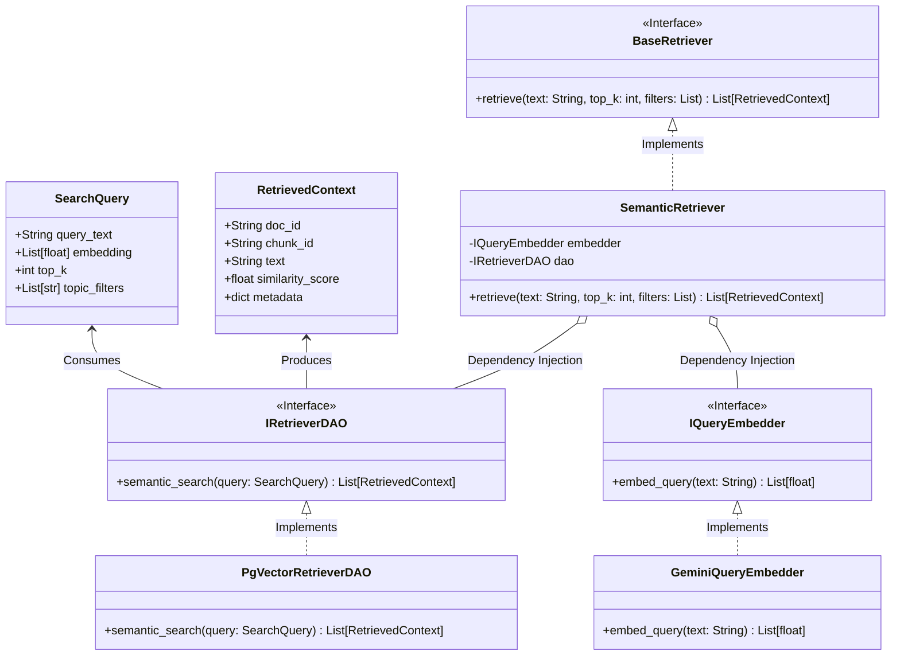
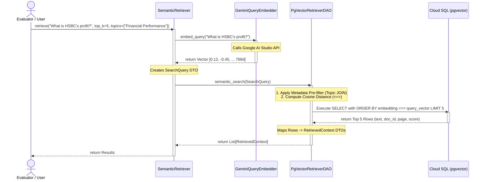

# Phase 2: RAG Retriever Architecture Design

## 1. Overview
The Retriever module is the critical bridge between the user's query and the LLM's generation/evaluation phase. Its sole responsibility is to accurately and efficiently fetch the most semantically relevant context chunks from the database.

To demonstrate senior-level Object-Oriented Programming (OOP) and strictly adhere to **SOLID principles**, the architecture isolates concerns into distinct layers: Data Transfer Objects (DTOs), Interfaces (Contracts), Concrete Implementations, and an Orchestrator. This ensures the Retriever is perfectly decoupled and highly testable.

---

## 2. Architecture Diagram (Mermaid)

---

## 2.5 Logic Flow Diagram (Sequence Diagram)

This sequence diagram illustrates the runtime behavior and interaction between the decoupled components during a retrieval request.

## 3. Core Components Deep Dive

### 3.1 Domain Models (DTOs)
Located in `src/domain/models.py`.
*   **`SearchQuery`**: Encapsulates the user's raw text, the generated embedding vector, the `top_k` parameter, and any optional metadata filters (e.g., `topic_filters = ["Risk Management"]`).
*   **`RetrievedContext`**: Represents the output of a search. Contains the chunk text, the parent `doc_id`, the origin page number, and critically, the `similarity_score` (calculated via cosine distance).

### 3.2 Interface Layer (Contracts)
Located in `src/interfaces/retriever_interfaces.py`.
By programming against interfaces rather than concrete classes, we follow the **Dependency Inversion Principle**.
*   **`IQueryEmbedder`**: Exposes a single method `embed_query()`. Unlike the batch embedder in Phase 1, this is optimized for low-latency, real-time single query embedding.
*   **`IRetrieverDAO`**: Defines the contract for vector databases. Accepts a `SearchQuery` and returns a list of `RetrievedContext`.

### 3.3 Concrete Implementations
Located in `src/retrieval/`.
*   **`GeminiQueryEmbedder`**: Implements `IQueryEmbedder` using the `google-genai` SDK. Translates the user's question into a 768-dimensional float array.
*   **`PgVectorRetrieverDAO`**: Implements `IRetrieverDAO` using `psycopg` and `pgvector`. 
    *   **Query Strategy**: Utilizes the `<=>` operator for Cosine Distance.
    *   **Pre-filtering**: Dynamically constructs SQL `WHERE` clauses if `topic_filters` are provided. By joining `document_chunks` with `document_topics`, we narrow the vector search space *before* computing distances, drastically improving precision and query speed.

### 3.4 Orchestration
*   **`SemanticRetriever`**: The master class combining the components.
    *   **Constructor Injection**: Receives `embedder: IQueryEmbedder` and `dao: IRetrieverDAO`.
    *   **Execution Flow**: 
        1. Validates input.
        2. Calls `embedder.embed_query()` to get the vector.
        3. Constructs a `SearchQuery` DTO.
        4. Calls `dao.semantic_search()`.
        5. Returns the structured list of `RetrievedContext`.

---

## 4. Engineering Highlights (For the Interviewer)
1.  **Open/Closed Principle**: If we want to switch from PostgreSQL to Pinecone, or from Gemini to OpenAI embeddings, we simply create a new implementation class. The `SemanticRetriever` orchestrator requires zero modifications.
2.  **Testability**: Because of Dependency Injection, we can trivially unit test the `SemanticRetriever` by injecting a `MockQueryEmbedder` and a `MockRetrieverDAO` without needing an active database connection or spending API credits.
3.  **Hybrid Search Readiness**: The `SearchQuery` DTO and the `IRetrieverDAO` interface are designed so that future upgrades (like adding keyword-based BM25 search) can be seamlessly integrated.
