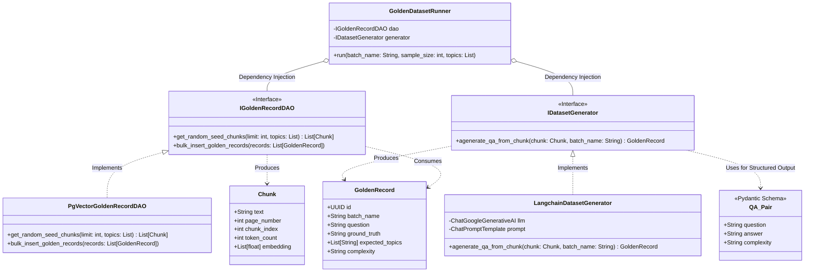
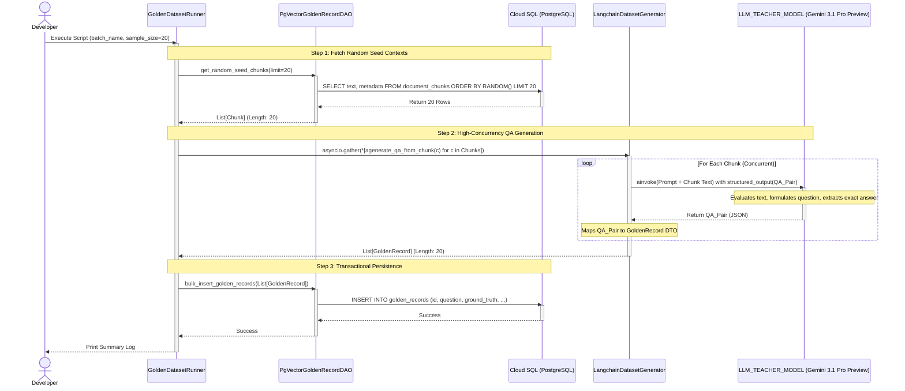

# Phase 3: Golden Dataset Generation Architecture
*Automated Synthetic Ground Truth for RAG Evaluation*

## 1. Overview
A stable enterprise RAG evaluation framework requires a high-quality benchmark dataset (Golden Records) containing pairs of realistic user questions and verifiable "exact" answers (Ground Truth). Instead of relying on manual SME annotation, this phase introduces an **Automated Synthetic Dataset Generator**. 

By randomly sampling factual text chunks directly from the ingested corpus (e.g., the HSBC Annual Report) and prompting an advanced LLM to "reverse-engineer" professional questions and answers, we guarantee that the evaluation benchmark is accurately aligned with the actual domain data and completely free from data contamination.

## 2. Architecture Diagram (Mermaid)

---

## 2.5 Logic Flow Diagram (Sequence)

This sequence diagram illustrates the parallelized execution flow used to rapidly synthesize the Golden Dataset without hitting API timeouts.

---

## 3. Core Components Deep Dive
The generation pipeline adheres to strict SOLID principles, separating database access, LLM orchestration, and workflow execution.

### 3.1 Domain Models (`src/domain/models.py`)
Introduces structured data carriers for the generation pipeline:
- **`GoldenRecord`**: A Pydantic model mapped directly to the `golden_records` database table. Contains `id`, `batch_name`, `question`, `ground_truth`, `expected_topics`, and `complexity`.
- **`QA_Pair`**: A lightweight Pydantic model specifically designed for LLM **Structured Output**. It guarantees the LLM returns exactly a `question`, `answer`, and `complexity` rating without conversational filler.

### 3.2 Data Access Object (DAO) (`src/dao/golden_record_dao.py`)
Handles all PostgreSQL interactions for the benchmark dataset.
- **`get_random_seed_chunks(limit: int) -> List[Chunk]`**: Queries the `document_chunks` table to extract $N$ random, high-quality text fragments to serve as the factual seed for the LLM.
- **`bulk_insert_golden_records(records: List[GoldenRecord]) -> None`**: Executes a batch `INSERT` to persist the newly synthesized QA pairs into the `golden_records` table, making them available for the Evaluation Runner.

### 3.3 The Core Generator (`src/evaluator/dataset_generator.py`)
The "Brain" of the operation, powered by LangChain and Gemini.
- **`LangchainDatasetGenerator`**:
 - Uses `ChatGoogleGenerativeAI` configured with a specific persona (e.g., "Senior Financial Auditor").
 - Evaluates via the `LLM_TEACHER_MODEL` (e.g., `gemini-3.1-pro-preview`), implementing the Asymmetric Compute pattern to ensure the "Teacher" out-reasons the "Student" (RAG Agent).
 - Employs the `with_structured_output(QA_Pair)` feature to force the LLM to return reliable JSON objects.
 - **`agenerate_qa_from_chunk(chunk: Chunk) -> GoldenRecord`**: Takes a single seed chunk, injects it into a meticulously crafted Prompt Template, and awaits the structured QA pair from the LLM.

### 3.4 The Orchestrator Runner (`src/runners/golden_dataset_runner.py`)
The executable script that wires the components together.
- **Workflow**:
 1. Initializes the DB Pool, DAO, and Generator.
 2. Defines the benchmark configuration (e.g., `batch_name="hsbc_2025_eval_v1"`, `sample_size=20`).
 3. Fetches 20 random chunks via the DAO.
 4. Dispatches the chunks to the Generator using `asyncio.gather()` for high-throughput concurrent generation.
 5. Bulk inserts the resulting `GoldenRecord` objects via the DAO.
 6. Outputs a human-readable summary log of the generated dataset.

## 4. Architectural Highlights for the Interview
- **Asymmetric Compute (Teacher vs. Student)**: By isolating `LLM_JUDGE_MODEL` (e.g., `gemini-2.5-pro` for low-latency inference) and `LLM_TEACHER_MODEL` (e.g., `gemini-3.1-pro-preview` for high-reasoning ground truth generation), the system proves its enterprise readiness to balance operational cost against evaluation quality.
- **Prevention of Data Contamination**: The Generator acts strictly as the "Teacher". It only sees the raw text chunks and does *not* interact with the RAG Retrieval pipeline, ensuring the Ground Truth is completely objective.
- **Structured LLM Output**: By using Pydantic schema enforcement during LLM generation, the pipeline is very resilient against parsing errors and unpredictable LLM behaviors.
- **High-Concurrency Execution**: Leveraging Python's `asyncio.gather`, the generation of hundreds of Golden Records can be parallelized, significantly reducing pipeline execution time while remaining within GCP rate limits.
