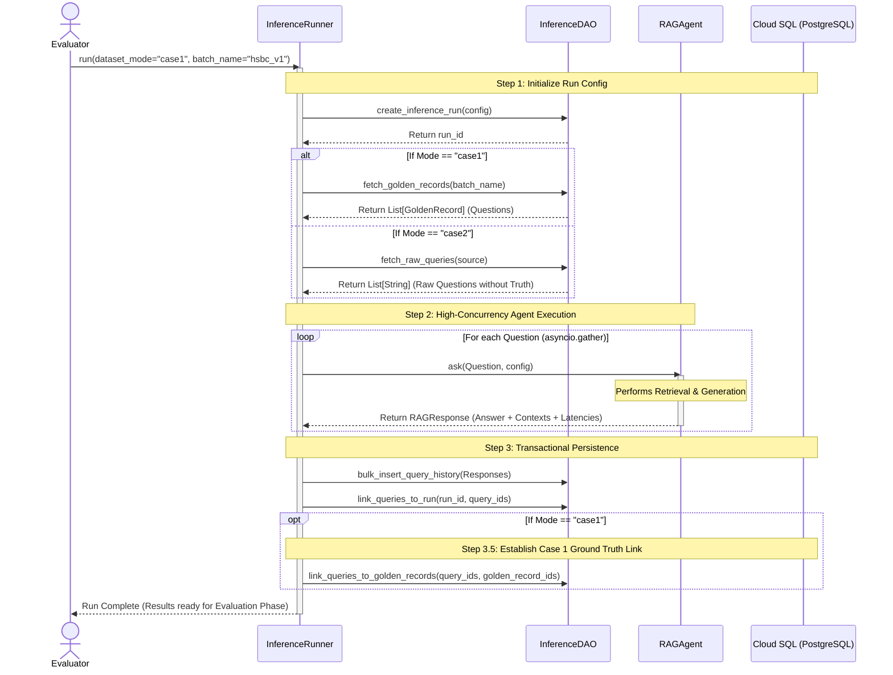

# Phase 4: Inference Runner Architecture
*Simulating Production RAG Traffic and Benchmarking (Case 1 vs Case 2)*

## 1. Overview
In a robust RAG evaluation framework, we must strictly delineate between the act of generating an answer (Inference) and the act of scoring that answer (Evaluation). The **Inference Runner** is responsible for the former: acting as a high-throughput load generator that simulates users asking questions to the RAG Agent under specific hyperparameter configurations.

Crucially, this architecture must support the two evaluation paradigms outlined in the assignment requirements:
- **Case 1 (Direct Evaluation):** The queries originate from our synthesized `golden_records` (which contain known Ground Truth answers).
- **Case 2 (Proxy Evaluation / Blind Testing):** The queries mimic raw production traffic where no human-verified Ground Truth exists.

This document details the architectural decisions made to elegantly support both scenarios within a unified data model.

## 2. Architectural Intent: The "Orphaned Query" Pattern
The defining feature of this architecture is how the database schema differentiates between Case 1 and Case 2 queries **without polluting the core `query_history` table with nullable flags or case-specific schema changes**.

### The Mechanism
All generated answers, regardless of their origin, are persisted identically into the `query_history` table. The differentiation happens entirely through **Relational Mappings**:

1. **Both Cases:** Every execution is logged in `inference_run_history` (capturing the RAG configuration like chunk size, top_k, etc.). Every query executed during that run is linked via the `inference_run_query_mapping` many-to-many table.
2. **Case 1 (Ground Truth Present):** If the query originated from a Golden Record, the system writes a row to `golden_record_query_mapping`. This explicit join links the generated answer (`query_history.generated_answer`) to its benchmark (`golden_records.ground_truth`).
3. **Case 2 (Blind Test / Production Logs):** The system intentionally **does not write** to `golden_record_query_mapping`. The query becomes an "Orphaned Query" relative to the benchmark dataset.

### Why This Design Excels (Interview Highlight)
When the subsequent *Evaluation Runner (Phase 5)* executes, its logic is elegantly simple:
- It performs a `LEFT JOIN` between `query_history` and `golden_record_query_mapping`.
- **If the join succeeds**, it triggers the **Case 1 Evaluator** (calculating deterministic metrics like Answer Correctness, Semantic Similarity, and Recall@K against the Ground Truth).
- **If the join yields NULL**, the system automatically detects a production-like blind test and degrades gracefully to the **Case 2 Evaluator** (using the LLM-as-a-Judge to score the RAG Triad: Context Relevance, Faithfulness, and Answer Relevance).

This guarantees that our system can ingest live production chat logs and evaluate them using the exact same pipeline designed for offline benchmarking.

## 3. Architecture Diagram (Mermaid)

```mermaid
erDiagram
    %% Core Tables
    inference_run_history {
        UUID run_id
        String chunking_config
        int top_k
        float similarity_threshold
    }
    
    query_history {
        UUID query_id
        String question
        JSONB retrieved_contexts
        String generated_answer
        Timestamp retrieval_time
        Timestamp response_time
    }
    
    golden_records {
        UUID id
        String batch_name
        String question
        String ground_truth
    }

    %% Mapping Tables
    inference_run_query_mapping {
        UUID run_id
        UUID query_id
    }
    
    golden_record_query_mapping {
        UUID query_id
        UUID golden_record_id
    }

    %% Relationships
    inference_run_history "1" -- "*" inference_run_query_mapping : Tracks
    query_history "1" -- "*" inference_run_query_mapping : Belongs To
    
    golden_records "1" -- "0..1" golden_record_query_mapping : Benchmarks (Case 1 Only)
    query_history "1" -- "0..1" golden_record_query_mapping : Evaluated Against
    
    %% Notes
    note for golden_record_query_mapping "If mapping exists -> Case 1 (Direct Eval)\nIf NO mapping -> Case 2 (Blind Eval / RAG Triad)"
```

## 4. Execution Flow (Sequence Diagram)

The `InferenceRunner` script is designed to accept a `dataset_mode` parameter, dynamically routing its behavior.



## 5. Next Steps
With this design, we will implement the `InferenceRunner` capable of executing our 48 generated Golden Records (Case 1) and a simulated list of "blind" questions (Case 2), paving the way for the LLM-as-a-Judge Evaluation engine.
