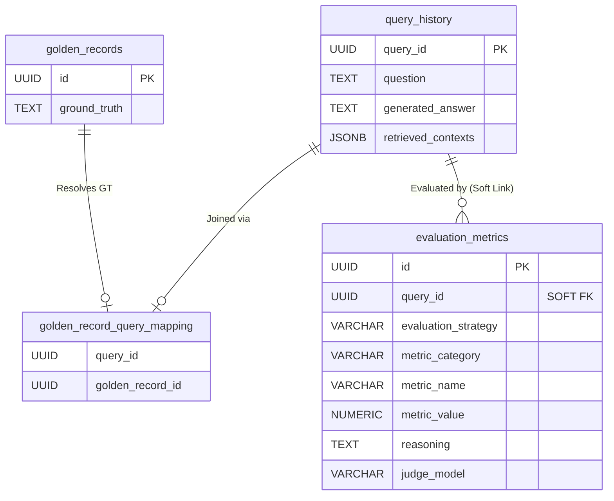
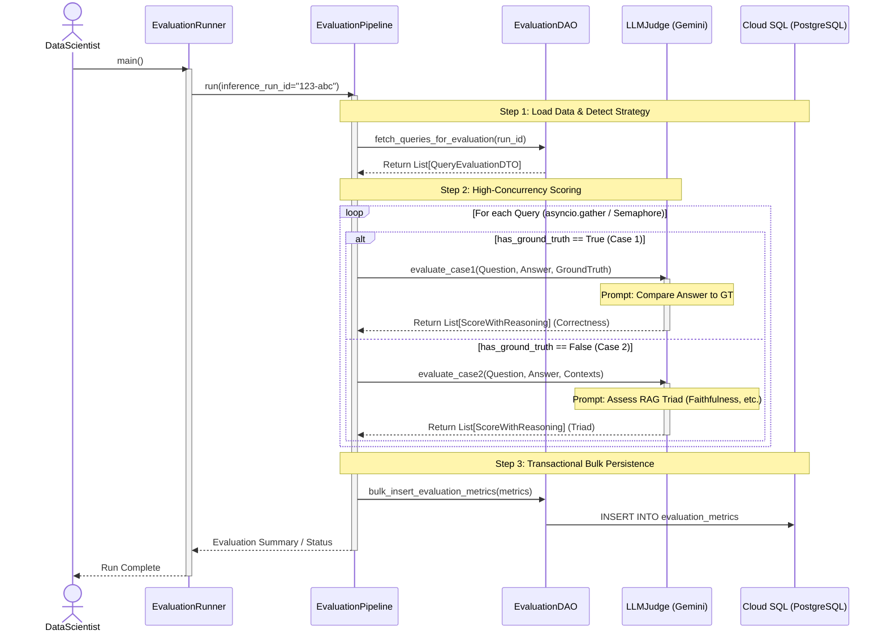

# Phase 5: Evaluation Runner Architecture
*LLM-as-a-Judge and The "Upgraded EAV" Metrics Pipeline*

## 1. Overview
The final phase of our RAG testing framework is **Phase 5: The Evaluation Runner**. While Phase 4 generated the answers, Phase 5 is responsible for grading them. This component operates entirely asynchronously from the generation phase, meaning it can load *historical* inference runs from the database and evaluate them long after the RAG Agent has finished its job.

The Evaluation Runner relies on an advanced LLM ("The Judge") to analyze the generated answers. Crucially, it must intelligently support our dual-track requirements:
- **Case 1 (Benchmark Scoring):** If Ground Truth exists, it measures Answer Correctness and Semantic Similarity.
- **Case 2 (The RAG Triad):** If no Ground Truth exists (e.g., live production logs), it evaluates Context Relevance, Faithfulness (Hallucination), and Answer Relevance.

## 2. Architectural Intent: The Upgraded EAV Model
In early prototypes, evaluation metrics were often pivoted into wide tables or strictly normalized into Entity-Attribute-Value (EAV) schemas. However, simple EAV schemas fail to capture the most valuable output of LLM-as-a-Judge systems: **Explainability**.

Our architecture utilizes an **Upgraded EAV Model 2.0** for the `evaluation_metrics` table:
1. **Per-Metric Granularity:** Each individual score (e.g., *Faithfulness*) gets its own row in the database, linked back to the `query_id`.
2. **Explicit Reasoning:** Alongside the numerical `metric_value` (e.g., 4.5), we store the LLM's `reasoning` (TEXT) explaining exactly *why* it awarded that score.
3. **Evaluation Strategy Isolation:** The `evaluation_strategy` field (e.g., 'CASE1_GROUND_TRUTH', 'CASE2_RAG_TRIAD') combined with the `judge_model` name ensures that a single query can be evaluated multiple times using different methodologies without metric collision.

This design guarantees infinite extensibility for future metrics while preserving perfect lineage and explainability for BI dashboard audits.

## 3. Entity-Relationship (ER) Diagram

The following UML focuses specifically on how the Evaluation components interact with the operational logs. Notice the absence of cascading deletes (Hard FKs) on the `evaluation_metrics` table, ensuring historical scores survive even if the raw logs are purged.



## 4. Execution Flow (Sequence Diagram)

The `EvaluationRunner` acts simply as the CLI/cron entrypoint. It configures the dependencies and delegates all heavy lifting to the `EvaluationPipeline`. The Pipeline orchestrates the extraction of historical inference data, automatically categorizing queries into Case 1 or Case 2, and dispatches them to the `LLMJudge`.



## 5. Structured LLM Output Design (LangChain Function Calling)

To guarantee the `LLMJudge` returns stable, parseable data capable of populating our EAV table, we utilize LangChain's `.with_structured_output()`. The LLM is forced to return a JSON array matching the following Pydantic schema:

```python
class ScoreWithReasoning(BaseModel):
    metric_name: str = Field(description="Name of the metric (e.g., 'Faithfulness')")
    score: float = Field(description="Numerical score from 0.0 to 5.0")
    reasoning: str = Field(description="Detailed explanation justifying the score")
```

This guarantees that the Runner never encounters string parsing errors (like `RegexParserError`) and can instantly map the output directly to the database columns.