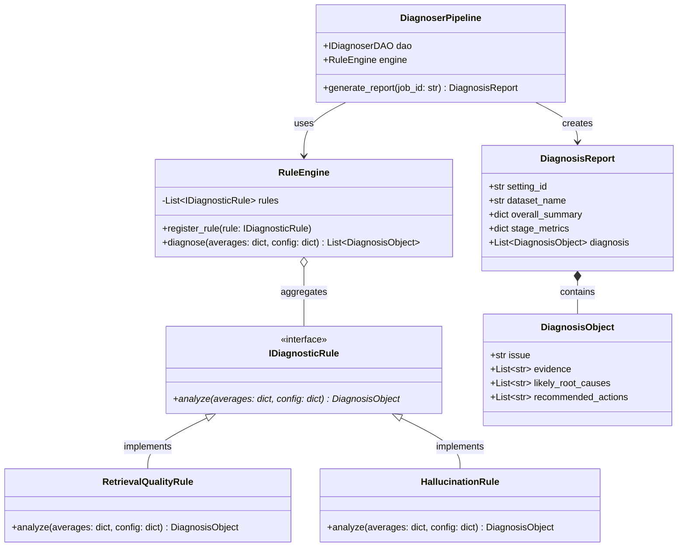
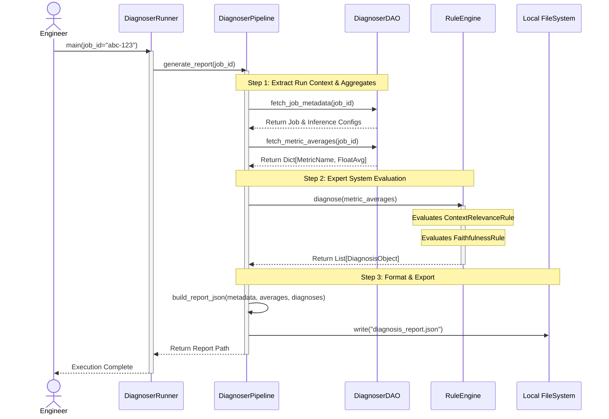

# Phase 6: Diagnoser Architecture
*Rule-Based Root Cause Analysis and Optimizer Suggestions*

## 1. Overview
The final piece of our automated RAG evaluation framework is **Phase 6: The RAG Diagnoser**. While the `EvaluationRunner` (Phase 5) computes granular scores for every query, the `RAGDiagnoser` is responsible for aggregating these scores across an entire hyperparameter sweep (Inference Run) and generating actionable, human-readable insights.

The Diagnoser acts as an automated "Expert System." It reads the quantitative metric averages from our database and applies a **Heuristic Rule Engine** to pinpoint qualitative bottlenecks (e.g., poor retrieval vs. hallucination) and outputs a structured JSON report.

Crucially, this phase fulfills the core assignment requirements:
- Generating the final `diagnosis_report.json` based on the provided template.
- Translating raw metric thresholds into `likely_root_causes` and `recommended_actions` targeting specific RAG components (Chunking, Indexing, Reranking, Generation).

## 2. Architectural Intent: The Expert Rule Engine
The Diagnoser is designed as a stateless, rule-based inference engine. It does not require calls to external LLMs (saving cost and ensuring deterministic repeatability).

### The Mechanism
1. **Aggregation:** The Diagnoser leverages PostgreSQL's aggregation capabilities via the `v_evaluation_metrics_pivot` view to calculate `AVG()` scores for a specific `job_id`.
2. **Thresholding:** It compares these averages against strict boundaries defined in the `optimizer_config.json` (e.g., `low_faithfulness: 3.5 / 5.0`).
3. **Rule Evaluation:** A chain of distinct `DiagnosticRule` objects analyzes the threshold breaches to deduce specific pipeline failures:
   - *Example Rule A:* IF `context_relevance` is low AND `correctness` is low $\rightarrow$ "Retriever Failure". Action: "Increase chunk size or top_k".
   - *Example Rule B:* IF `context_relevance` is high AND `faithfulness` is low $\rightarrow$ "Generator Hallucination". Action: "Decrease temperature or switch to stricter prompt".

### Architectural Rationale
By treating the rules as distinct, composable Python objects implementing a common `IDiagnosticRule` interface, the system avoids "spaghetti IF-ELSE" code. New diagnostics (e.g., latency checks, cost analysis) can be added purely by registering a new rule class.

## 3. Data Flow Context & Class UML
The Diagnoser **does not** introduce any new tables to the database. Instead, it acts purely as an analytical consumer, performing heavy aggregations (`SELECT AVG(...)`) across the structures established in prior phases.

The system relies on pure Object-Oriented polymorphism. `IDiagnosticRule` implementations decouple the logic of evaluating specific failures (e.g., hallucination vs. poor context retrieval) from the core engine.



## 4. Execution Flow (Sequence Diagram)

The `DiagnoserRunner` serves as the entrypoint. It utilizes a `DiagnoserPipeline` to coordinate the DAO extraction and the Rule Engine processing.



## 5. Output Specification: `diagnosis_report.json`
The pipeline adheres strictly to the provided assignment template, ensuring automated grading parsers accept the output:

```json
{
  "setting_id": "32f23ad6-8d00-4a7f-a1ae-29b7b50dfc91",
  "dataset_name": "hsbc_2025_eval_v1",
  "overall_summary": {
    "quality_score": 4.12,
    "latency_seconds": 1.25,
    "cost_estimate": 0.05
  },
  "stage_metrics": {
    "retrieval": {
      "context_relevance": 3.4
    },
    "generation": {
      "faithfulness": 4.8,
      "answer_relevance": 4.2
    },
    "end_to_end": {
      "correctness": 4.1
    }
  },
  "diagnosis": [
    {
      "issue": "Low Retrieval Quality",
      "evidence": [
        "context_relevance (3.4) is below the strict threshold of 4.0"
      ],
      "likely_root_causes": [
        "Chunk size too small causing context fragmentation",
        "Semantic embedding model domain mismatch"
      ],
      "recommended_actions": [
        "Try recursive_section_aware chunking strategy",
        "Increase top_k retrieval parameter from 5 to 10"
      ]
    }
  ]
}
```